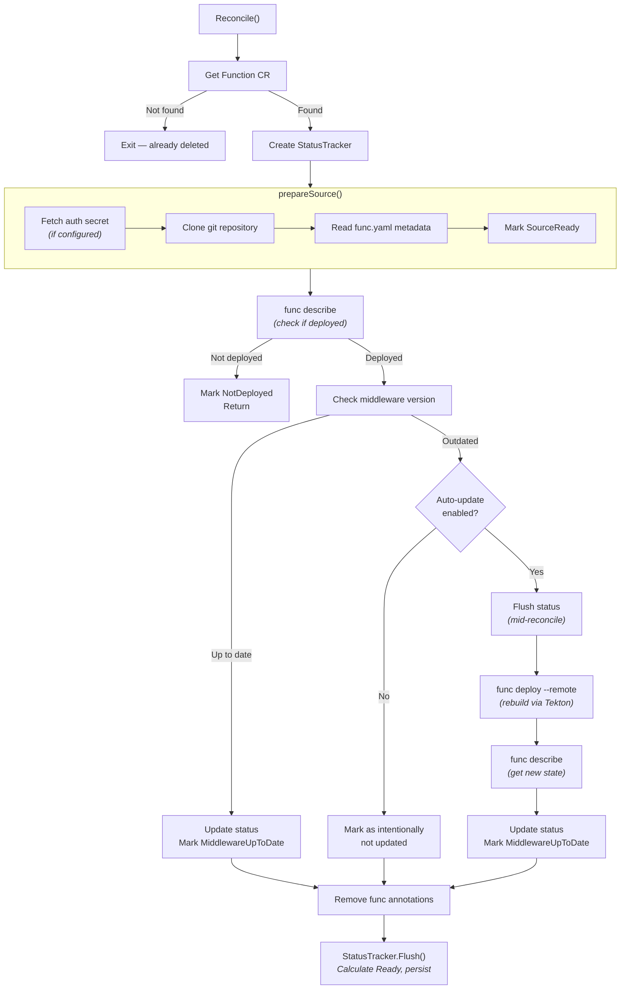

# Architecture Overview

## What This Operator Does

func-operator is a Kubernetes operator that monitors serverless functions deployed with the [Knative `func` CLI](https://github.com/knative/func). Its primary job is **middleware lifecycle management**: it detects when a function's middleware is outdated and automatically rebuilds the function using the latest version.

The operator does **not** handle initial deployment. Functions must first be deployed with `func deploy`. The operator then takes over ongoing maintenance.

## Components

- **FunctionReconciler** (`internal/controller/`) — The central controller. Watches `Function` custom resources and reconciles them. Also watches the `func-operator-controller-config` ConfigMap to re-reconcile functions when the operator-wide `autoUpdateMiddleware` default changes. Runs up to 10 concurrent reconciliations.

- **FuncCliManager** (`internal/funccli/`) — Wraps the Knative `func` CLI binary. Periodically checks GitHub for new releases and downloads them (with SHA256 checksum verification and atomic install). Runs `func deploy`, `func describe`, and `func version` as subprocesses. The download logic (`DownloadAndInstall`) is shared with e2e test utilities via `internal/funccli/download.go`.

- **GitManager** (`internal/git/`) — Clones function source repositories with authentication support: HTTP/HTTPS (token or basic auth) and SSH (private key with optional passphrase and known_hosts). Uses go-git for pure-Go shallow cloning (single-branch, depth 1).

- **StatusTracker** (`internal/controller/status_tracker.go`) — Buffers status changes during reconciliation and persists them in a single API call at the end via `Flush()`. Supports mid-reconcile flushes for long-running operations (e.g., before a deployment starts) so users see progress.

## CRD: Function

Defined in `api/v1alpha1/function_types.go`. A `Function` resource represents a deployed serverless function that the operator should monitor.

**Spec** (user-provided):
- `repository.url` — Git repository containing the function source
- `repository.branch` — Branch to track (optional, defaults to repo default)
- `repository.path` — Subdirectory within the repo (for monorepos)
- `repository.authSecretRef` — Secret for private repo authentication
- `registry.authSecretRef` — Secret for container registry authentication
- `autoUpdateMiddleware` — Override operator default (optional)

**Status** (operator-managed):
- `git` — Resolved branch, observed commit, last check time
- `deployment` — Current image, build time, deployer, runtime
- `middleware` — Current/available versions, auto-update config, rebuild state
- `service` — URL and readiness of the underlying Knative Service
- `conditions` — Standard Kubernetes conditions (see below)
- `history` — Last 20 reconciliation events

## Reconciliation Flow

### Conditions

The operator maintains five conditions on each Function:

| Condition | Meaning |
|-----------|---------|
| `Ready` | Overall health (calculated from all other conditions) |
| `SourceReady` | Git clone and metadata read succeeded |
| `Deployed` | Function exists in the cluster |
| `MiddlewareUpToDate` | Function uses the latest middleware version |
| `ServiceReady` | Underlying Knative Service is ready |

`Ready` is automatically calculated: it is `True` only when all other conditions are `True`.

## Deployment and Build

The operator uses **Tekton Pipelines** for building function images. During `func deploy --remote`, the func CLI creates a Tekton PipelineRun in the function's namespace. The operator sets up the necessary RBAC (Role + RoleBinding) for the pipeline to run.

Supported builders: `pack` (Cloud Native Buildpacks) and `s2i` (Source-to-Image).

Supported deployers: `knative` (Knative Serving) and `raw` (plain Kubernetes Deployment), with experimental `keda` support (HTTP-based autoscaling).

## Configuration

The operator reads its default config from a ConfigMap named `func-operator-controller-config` in the operator's namespace:

| Key | Description | Default |
|-----|-------------|---------|
| `autoUpdateMiddleware` | Whether to auto-rebuild functions with outdated middleware | `true` |

Per-function overrides are possible via `spec.autoUpdateMiddleware` on the Function CR.

## E2E Test Infrastructure

E2E tests run in a KinD cluster with:
- **Gitea** (in-cluster Git server) for complete test isolation
- **Local container registry** with self-signed TLS
- **Tekton Pipelines** for build execution
- **Knative Serving** (or raw/keda deployer depending on test matrix)

See [Gitea Integration](development/gitea-integration.md) for details on the test infrastructure.